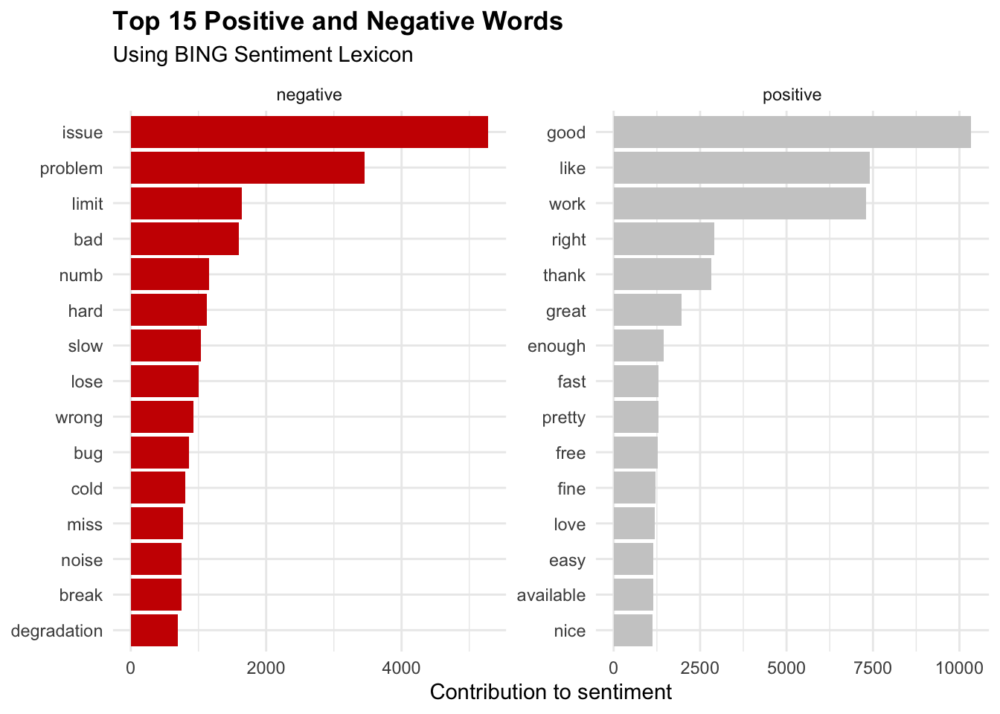
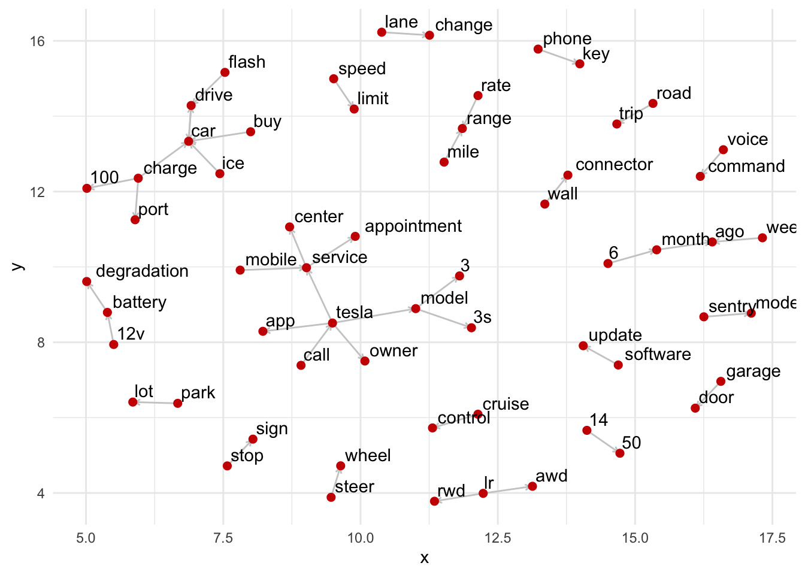
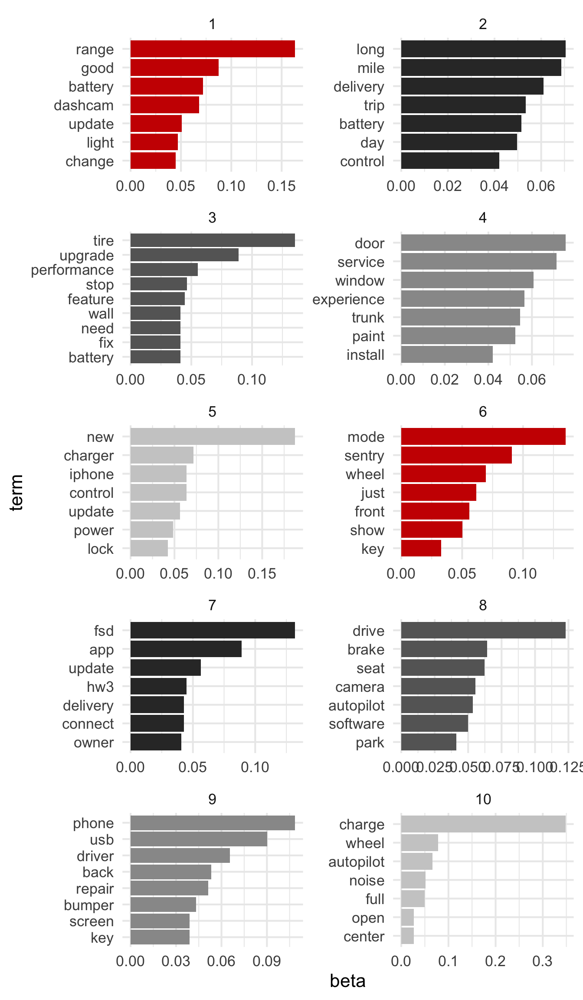

# Tesla Model 3 Forum Analysis

This report looks at user's discussions, mostly in 2020, from the [Tesla Model 3 Discussion Forums](https://forums.tesla.com/categories/tesla-model-3) to surface what is top of mind and what issues might still be effecting the Model 3.  The forums are an open place where people can post topics, ask questions, or generally participate in the community.  User forums are rich with information that can give an alternative view into customer sentiment, unlike Social Media or traditional Surveys. 

**Note:** This report will not look to surface the root cause of issues, positive or negative, but rather surface topics that are most top-of-mind for customers and where the Tesla team could investigate further.

## General Sentiment
Focusing on the **Negative** words, the top occurrence is **issue**, and the second is **problem**.  Given this forum's nature, talking about a product, these are very practical words to be on the top of the list.  People are reporting or discussing issues and problems with their cars. **Bug**, **Noise**, **Break**, and **Damage** all feel like perfect matches as well.  

## Top Feature Discussions
Now that we know the sentiment, we can start identifying the topics most frequently discussed on the forum. For this exercise, we'll employ two different methods.  The first is a model called n-Grams, which looks and reoccurring sequences of words.  We will use bi-grams, which looks at two-word combinations and their frequency.  The second model is known as Topic Modeling. Topic modeling is a method for unsupervised classification which finds natural groups of items, regardless if you know anything about the text.

## Bigrams

## Topic Modeling

